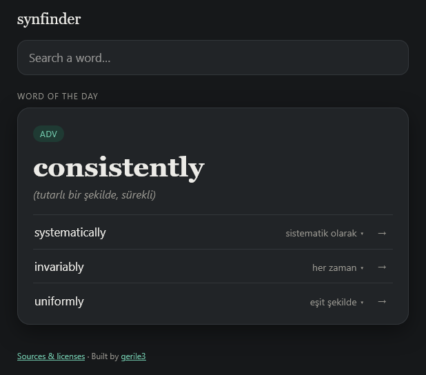
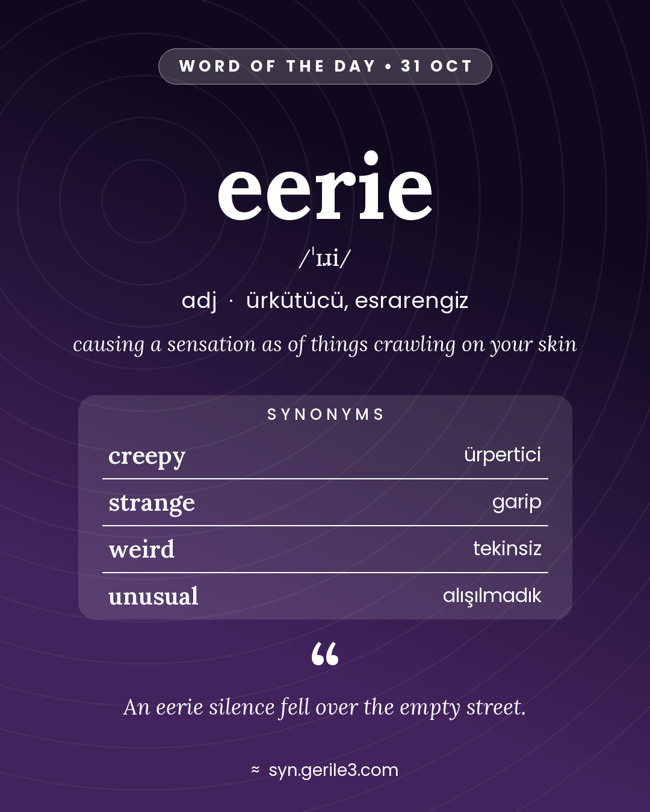
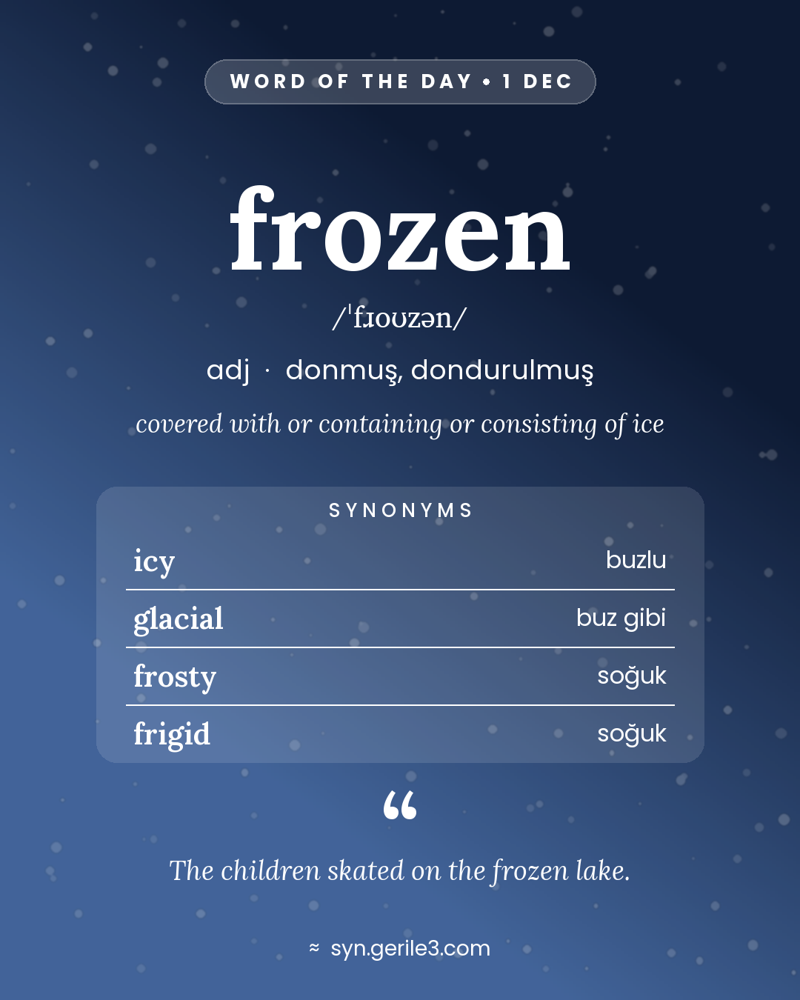
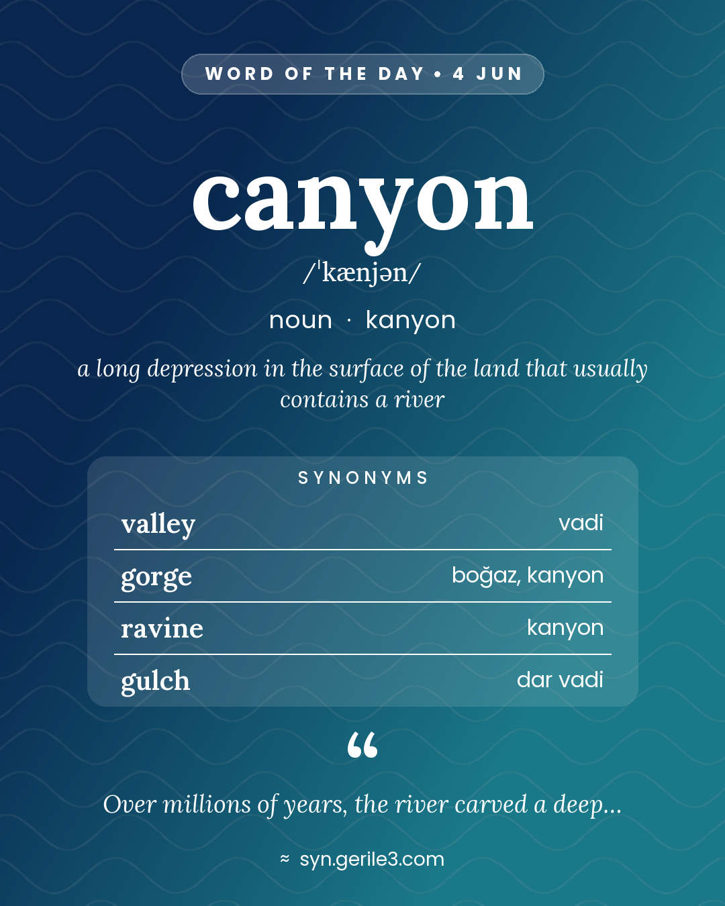

# Synfinder

**English synonyms with Turkish meanings.** Search an English word and get its best synonyms, grouped by part of speech. Each synonym comes with its Turkish meaning, a definition and an example sentence, and most words show how they are pronounced.

🔎 **Live:** [syn.gerile3.com](https://syn.gerile3.com) · 📖 **Word of the Day on Telegram:** [@synfinder_daily](https://t.me/synfinder_daily)

<p align="center">
  
</p>

> This repository documents the project. The source code is private.

---

## Features

- **Word cards per part of speech.** *bank* as a noun and *bank* as a verb are separate cards. Each card shows the top synonyms, ranked by how many independent sources agree on them.
- **Turkish meaning for every synonym, matched to its sense.** The Turkish follows the meaning the synonym is used in, not just the first dictionary translation (*tip → bahşiş* vs. *tip → devirmek*).
- **Definitions and example sentences** for each synonym. Only sentences that actually contain that word in that sense are shown.
- **Pronunciation.** The IPA spelling under the word (American, matched to the part of speech: *read* /ɹid/ as a verb, /ɹɛd/ as a noun) and a 🔊 button that reads the word aloud.
- **Search helpers.** Autocomplete, and "did you mean" suggestions for typos (*hapy → happy*).
- **Offensive-word masking.** Heavy profanity and slurs are hidden behind `•••` and revealed on click. Mild slang is left alone.
- **Word of the Day.** One word a day on the site, and as a short video card with its pronunciation on the Telegram channel. The first year is hand-picked: balanced across nouns, adjectives, verbs and adverbs, with seasonal words and words for special days.

## Word of the Day cards

Every day at 12:01 (Istanbul time) a bot posts a card to the Telegram channel. The background colour and pattern come from the word's WordNet category (animals, feelings, motion, food…), with a small variation per word. The same word always produces the same image.

The card is sent as a short video: the image plus the word spoken aloud. It loops silently in the feed, and a tap plays the pronunciation.

<p align="center">
  
  
  
</p>

## How it works

```
Open English WordNet ─┐
Wiktionary ───────────┤
Moby Thesaurus ───────┼─► ETL pipeline ─► SQLite ─► Flask API + web UI ─► syn.gerile3.com
SemCor ───────────────┤        ▲                  └► Telegram bot (daily video card)
wordfreq ─────────────┘        │
                     manual review layer
          (translations, examples, sense fixes, rejects)
```

- **Data pipeline.** Five open datasets are imported into one SQLite database, and each card's top synonyms are computed ahead of time. Sources are weighted and combined: WordNet and Wiktionary synonym lists count most, while thesaurus entries and "near" senses act as supporting votes.
- **Sense matching.** A word like *like* has many meanings. The pipeline works out which sense each synonym belongs to, so the definition, example and Turkish meaning all match. It uses definition overlap, reverse lookups and the dictionary's main etymology.
- **Manual review layer.** Plain TSV files that override the automatic results: reviewed Turkish translations, extra example sentences, corrected senses and rejected synonyms. They are re-applied on every build.
- **Serving.** The database is read-only at runtime. A small Flask app serves the API and a vanilla-JS single-page UI.

### By the numbers

| | |
|---|---|
| English words (lemmas) | ~136,000 |
| Synonym entries on cards | ~227,000 |
| Curated Turkish translations (manual layer) | ~54,500 |
| Curated example sentences | ~17,000 |
| Words with a pronunciation (IPA) | ~45,000 |

## Tech stack

- **Language & data:** Python, SQLite, wordfreq, Pillow (image cards), ffmpeg (video cards)
- **Web:** Flask, gunicorn, vanilla JavaScript/CSS
- **Hosting:** Raspberry Pi 5 (homelab), Caddy, Cloudflare Tunnel, git push-to-deploy
- **Bot:** Telegram Bot API (send-only), cron

## Data sources & licenses

| Source | Used for | License |
|---|---|---|
| [Open English WordNet 2025](https://en-word.net) | Senses, definitions, synonyms, examples, pronunciations | CC BY 4.0 |
| [Wiktionary](https://kaikki.org) (via wiktextract) | Extra synonyms, Turkish translations, examples, pronunciations | CC BY-SA |
| [SemCor](https://github.com/globalwordnet/semcor) (OEWN-aligned) | Sense-tagged example sentences | CC BY 4.0 |
| [Moby Thesaurus II](https://github.com/elitejake/Moby-Project) | Supporting signal for ranking | Public domain |
| [wordfreq](https://github.com/rspeer/wordfreq) | Word frequencies | Data CC BY-SA 4.0, code Apache 2.0 |

Fonts on the image cards: [Lora](https://github.com/cyrealtype/Lora-Cyrillic), [Poppins](https://github.com/itfoundry/Poppins) and [Charis SIL](https://software.sil.org/charis/) for IPA (SIL Open Font License).

---

Built by [gerile3](https://github.com/Gerile3).
